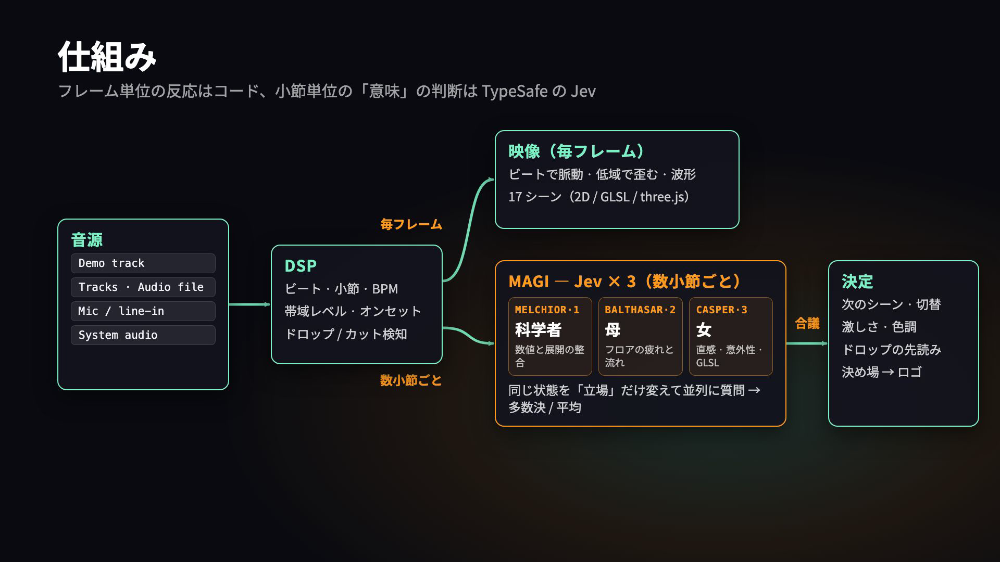

# Jev VJ



音声解析（DSP）でビートを刻み、TypeSafe の System One モデル **Jev** が数小節ごとに
「今どのセクションか / 次のシーン / 激しさ / 色調 / ドロップは近いか」を判断する
VJ プロトタイプ。Jev はテキスト入力のみなので音は直接渡さない。
**フレーム単位の反応はコード、小節単位の"意味"判断は Jev** という分業。

```
mic / file / demo ──▶ AnalyserNode (50 Hz)
                        ├─ band levels, flux, onsets ──▶ renderer (every frame: beat pulse, bass, waveform)
                        ├─ beat tracker (bpm / bar)
                        └─ bar summaries (last 12 bars) ──▶ Jev every N bars ──▶ scene / intensity / palette
                                                                  └─ drop_scene (先読み) → armed → DSP がドロップ検知した瞬間に cut
```

## 実測

- Jev 往復 ≈ 0.25–0.6 s（state ≈ 3k tokens、8 questions 並列）。128 BPM の 1 小節は 1.9 s なので 1–2 小節ごとに余裕で聞ける。
- コスト ≈ $0.13 / 時間（2 小節ごと）。
- ビート追従は自己相関 + コムフィルタ。デモ曲（128 BPM）は 4 秒で 128.1 にロック。
- デモ曲の通し（2026-09-22 実測）: ブレイクダウンで Waves/Kaleido・intensity 0.15 → 2 回目のビルドで Jev が build / drop_soon 0.62 → Strobe を arm →
  9 秒後、DSP がキックの復帰を検知した瞬間に Strobe へ cut → 8 小節で Grid へ（コード側の上限）。38 コール / $0.005。

## デプロイ（Cloudflare Workers → https://jevj.sayuno.me）

`worker/index.ts` が静的ビルド（`dist/`, Workers Static Assets）を配信し、`/api/jev` を TypeSafe に中継する。ログインは無し（公開）。
API キーは Worker の secret にしかない。課金の走る `/api/jev` は 3 段で守る:

1. **同一オリジンからの POST だけ**通す（`Sec-Fetch-Site` / `Origin` はブラウザが付ける値で、ページの JS からは偽装できない）。
2. **質問 ID の許可リスト**（`phase`, `drop_soon`, `switch_now`, `scene`, `drop_scene`, `intensity`, `palette`, `transition`, `kime`, `kime_on_drop`）以外は中継しない。他用途の LLM 代理には使えない。
3. **Rate Limiting バインディング**（`wrangler.jsonc` の `ratelimits`）: クライアント IP ごとに 90 回/分、サイト全体で 400 回/分。3 体合議は 1 審議 3 回なので通常運用は 20〜45 回/分。
   最悪ケース（全体上限に張り付き）でも 400 回/分 ≈ 2.2M tokens/分 ≈ $0.09/分。

さらに、ファイル名っぽいパス（`/tracks/x.mp3` など）が無いときは SPA の index.html を返さず 404 にし、`/assets/` は immutable、mp3 は 1 日、HTML は no-cache でキャッシュする。
`/api/spotify` は本番では `unavailable` を返す（AppleScript はローカル専用）。`public/.assetsignore` で `.omc` などのツール状態ファイルを公開物から除外。

```bash
npm run build                      # dist/ + worker の型チェック
npm run preview:worker             # wrangler dev（port 8788）。POST のテストは Origin: http://jevj.sayuno.me を付ける（dev は routes のホスト名で URL を組む）
npx wrangler secret put TYPESAFE_API_KEY
npm run deploy                     # wrangler deploy（routes: jevj.sayuno.me, custom_domain → DNS も自動）
```

- `wrangler.jsonc` の `routes` が custom domain なので、sayuno.me ゾーンがあるアカウントに **そのアカウントの認証で** デプロイする。
  別アカウントのトークンを使うときは `CLOUDFLARE_API_TOKEN`（権限: Workers Scripts:Edit, Workers Routes:Edit, Zone:Read, DNS:Edit）と `CLOUDFLARE_ACCOUNT_ID` を環境変数で渡す。
- 音源 8 曲（約 90 MB）も dist に入るが、mp3 は git には入れない。`public/tracks/index.json` の `source`（archive.org の元リリース）から `npm run tracks` で取得する。CI も同じ。
- **GitHub Actions**（`.github/workflows/deploy.yml`）: `main` への push で `npm ci` → 音源取得（キャッシュ）→ build → `cloudflare/wrangler-action` で deploy。
  リポジトリの Secrets に `CLOUDFLARE_API_TOKEN`（個人アカウントで「Edit Cloudflare Workers」テンプレート＋ Zone sayuno.me の DNS:Edit）と `CLOUDFLARE_ACCOUNT_ID` が必要。トークン未設定のうちはビルドだけ通してデプロイをスキップする。

## 動かす

```bash
export TYPESAFE_API_KEY=...   # dev サーバーの環境変数。クライアントには渡らない（vite.config.ts の /api/jev プロキシ）
npm install
npm run dev                    # http://localhost:5183
```

- **Demo track**: 128 BPM のテクノを合成して再生（intro → build → drop → breakdown → build → drop → outro）。
- **Audio file…**: 手元の曲。 **Mic / line-in**: DJ ミキサーの出力など（モニター出力はしない）。
- **Tracks**: `public/tracks/index.json` に並べた曲のプレイリスト（選択・再生・前後・シーク・自動で次へ）。
  デコード済みバッファはキャッシュし、再生中に次の曲を先読みデコードするので曲間・シーク・再スタートに空白が出ない。
  再生位置は毎秒 sessionStorage に保存し、リロード（HMR 含む）後は同じ曲の同じ位置から自動再開する。
  ブラウザの自動再生制限で AudioContext が止まっている場合は「クリックで再開」と出て、最初のクリック / キーで続きから鳴る。
  mp3 自体は git 管理外（`.gitignore`）。今入っているのは archive.org のネットレーベル音源 8 曲:

  | 曲 | ジャンル | ライセンス |
  | --- | --- | --- |
  | Kay Grove – Samba 440 / Night Walk [rest037] | latin / deep house | CC BY-NC-ND 3.0 |
  | 2loop – going in bedroom / tears of strong man [diginet008] | deep house | CC BY-NC-ND 2.5 |
  | djPiCi – quadro [diginet001] | tech-house | CC BY-NC-ND 2.5 |
  | A.J.S.A.R.S – Noro Virus [alw017] | minimal house | CC BY-NC-ND 2.0 DE |
  | AFM – Sometimes [MNF033] | house / minimal | **CC BY-SA 4.0** |
  | Yan Ots – Euro Attraction (AfroDisco Mix) [RAR004] | disco-house | CC BY-NC-SA 2.5 |

  NC / ND の曲は社外デモや公開時に差し替えること（AFM は BY-SA なので使いやすい）。
- `?audio=<url>` で URL 再生ボタンを追加（Vite の `/@fs/` 経由でローカルファイルも可）。
- `h` でパネル非表示、`f` で全画面。Mute はスピーカーだけ切って解析は続ける。

## MAGI: 3 体の Jev で合議する

`src/director.ts`。同じ Jev に **立場だけ変えた state** を渡し、3 リクエストを並列で投げる（`src/jev.ts` の `UNITS`）:

| unit | 立場 | 傾向 |
| --- | --- | --- |
| MELCHIOR·1 | 科学者 | 数値と展開の整合。根拠がなければ切り替えない |
| BALTHASAR·2 | 母 | フロアの疲れと流れ。連続性重視、強い刺激は短く |
| CASPER·3 | 女 | 直感と美意識。コントラスト、意外性、GLSL/three.js を積極的に |

各 unit の「提案」= `switch_now ≥ 0.5` なら `scene`、それ以外は維持。決議はコード側: Choice は多数決（割れたら確率の合計）、Noul/Score は平均。
2/3 が切替を提案するか、合議の `switch_now` と古さのルールを満たせば **可決** → 切替。ホールド中・切替中なら **否決**。誰も提案しなければ **維持**。
各 unit には最終決議への **賛成 / 反対** が付く。

審議は画面全体に薄く流れる **CLI 風ログ**（`src/terminal.ts`）で見せる: `審議開始` → 3 体の回答が届いた順に 1 行ずつ（提案 / switch / phase / int / drop / kime / latency）→ `合議` → 決議。
ログは 2 層: **解析ストリーム**は小節ごとに 1 行。今の小節はプロンプトのすぐ上で `bar 42 ●●○○ ▃▅__ e0.82 sub0.71` のようにビートごとに埋まっていき（拍ごとの音圧をスパークラインに）、小節が終わると `bar 42 ●●●● ▃▅▇▆ 128.1bpm e0.82 sub0.74 bf0.55 … on12 trend +0.03` として確定してログに入る。
各審議の先頭には **入力の要約行**（`入力 :: 音圧 0.66 (相対 0.92) 層[キック、ベースライン、…] 傾向 e↑ bass→ hi↑ on→ | scene=tunnel age=12 prev=[…] 前回=build ctx="…"`）が出るので、何を見てどう答えたかが並んで読める。
サイドパネルの「#N 入力 (state) → 出力 (answers) を見る」を開くと、送った state の JSON 全文と 3 体の回答・合議結果が見られる。
**決議**（可決 / 否決 / 維持 / 決め場）は文字の太さ・サイズはそのままに、全幅の色帯＋反転バッジ＋▶ で目立たせる（可決＝緑、否決＝赤、維持＝橙、決め場＝黄）。
最下行は `magi@bakurocho:~$ ●○○○ bar 42 · 128bpm ▮▮▮▯▯ · tunnel int0.61 cold · build · armed→strobe · MAGI… █` のプロンプト 1 行に集約（旧 HUD は削除）。20 秒より古い行は徐々に薄くなる。
テキスト系オーバーレイはステージとは別の透明キャンバスに描くので、シーンの残像フェードに巻き込まれない。
DSP のドロップ検知や arm もログに出る。`m` で表示切替、パネルのチェックで単体 Jev に戻せる。
3 並列でも往復は 0.25〜0.5 s、コストは 3 倍（≈ $0.15/h）。

## リクエスト数の抑制（`src/director.ts`, `src/features.ts`）

3 体並列なので 1 審議 = 3 リクエスト。無駄な審議を落とす仕組みが 3 つ:

1. **ジャンプ検知のヒステリシス**: `BarAggregator` が「高エネルギー状態か」を持ち、surge は状態に入る瞬間（または入った時の音圧よりさらに 25% 上がった時）だけ、cut は状態から出る瞬間だけ報告する。キック復帰（`kickReturns`）は常に報告。
   さらに `Director.onJump` は同種のジャンプ起因の審議を 4 小節あけないと再発火しない（armed の即 cut は 0 ms のまま）。
2. **変化がなければ定期審議をスキップ**: 前回審議時の直近 2 小節要約（e / sub / bf / mid / high の平均、onsets）と比べ、差が全部 0.05 未満・onsets ±2 以内・armed なし・シーン age < 16 なら送らず `変化なし → skip` とログだけ出す。
3. **落ち着いていれば間隔を伸ばす**: 前回の合議が drop / steady で switch_now < 0.3、drop_soon < 0.3、armed なしなら次の定期審議を 4 小節後に（それ以外は設定値の 2 小節）。

パネルの `calls` 行に「審議数 · skip 数 · next +N」が出る。

## 決め場のロゴ（BAKUROCHO DOMINO CLUB PRESENTS 🍲闇鍋🍲）

`src/logo.ts`。Jev に 2 問追加:
- `kime`（Noul）: 今が決め場か。合議の平均 ≥ 0.6、または過半数が ≥ 0.5 かつ平均 ≥ 0.5 で **8 小節表示**、その後 **16 小節のクールダウン**。表示中に kime < 0.25 が出れば早めに引っ込める。
- `kime_on_drop`（Noul、先読み）: ドロップが来たらその瞬間は決め場か。`drop_scene` と一緒に arm され、DSP がドロップを検知した瞬間にシーン cut と同時にロゴが出る。

規定値はメイン「🍲闇鍋🍲」（大）＋サブ「BAKUROCHO DOMINO CLUB PRESENTS」（小、字間広め、上に配置）。パネルでメイン / サブ / サブの上下を変えられる。
演出: 黒帯が中央から開き、文字が左から右へワイプイン、ビートで微かに脈動、オンセットでパレット色のゴーストがずれる。`l` キーか「Logo now」で手動トグル（VJ の override）。

### フォント（Google Fonts）

パネルの Fonts 欄に Google Fonts の family 名を入れると、その場で読み込んで使う（`src/fonts.ts`）: ロゴ和文 / ロゴ欧文 / CLI ログの 3 か所。
`fonts.googleapis.com/css2` の stylesheet を regular・700・900 の 3 本注入し（存在しない weight は自分のリンクだけ失敗する）、
`document.fonts.load` に実際に描く文字列を渡して和文の unicode-range サブセットまで確実に取る。届いた中で一番重い weight をロゴに使う。
選択は localStorage に保存。プルダウンには候補が常に全部出る。候補にない family はテキスト欄に入れて Enter で追加・読み込み。

**ランダム切替**: 「ロゴのフォントをランダム切替」を入れると、候補の和文 / 欧文フォントをすべて先読みしてから、指定秒（既定 0.4 s、0.05 s 刻み）ごとにメイン行とサブ行のフォントを別々にランダムに差し替える。「ビート同期」にすると秒ではなくビートごとに切り替わる。文字サイズは各フォントで画面幅に合わせて再計算される。切替を切ると選んでいたフォントに戻る。

## Spotify（この Mac で鳴っている曲）に同期する

- **曲名の同期**: dev サーバーが AppleScript で Spotify の再生中トラックを読む（`/api/spotify`、2 秒ごとにポーリング）。
  パネルに表示し、再生中なら「Spotify で再生中: アーティスト「曲名」」を Jev の `context` に足す。初回は macOS の
  オートメーション許可ダイアログ（node → Spotify）を許可する。
- **音声の同期**: ブラウザは他アプリの音を直接は取れない。2 経路:
  1. **System audio** ボタン → 画面共有ダイアログで「システム音声を共有」を選ぶ（Chrome / macOS 13+ で画面全体を選んだとき）。映像トラックは即破棄、音声だけ解析、モニター出力なし。
  2. BlackHole 等の仮想オーディオデバイスを入れ、Audio MIDI 設定で「複数出力装置」（スピーカー + BlackHole）を作って Spotify の出力にし、
     **Mic / line-in** の input で BlackHole を選ぶ。`brew install --cask blackhole-2ch`（要管理者）。
  Spotify のアプリ内再生（Web Playback SDK）は DRM のため AnalyserNode に通せない。

## Jev に何を渡し、何を聞くか

`src/jev.ts`。state は「小節ごとの数値要約 + セットの文脈（今のシーン、経過小節、直前の判断）+ ユーザーが書く文脈（ジャンル・狙い）」。
questions は独立した 8 問を 1 リクエストで並列に聞く:

| id | 型 | 使い方 |
| --- | --- | --- |
| `phase` | Choice | intro / build / drop / breakdown / steady / outro。HUD 表示と arming の条件 |
| `drop_soon` | Noul | ≥ 0.5 で `drop_scene` を arm（12 小節有効） |
| `drop_scene` | Choice | **先読み**。ドロップが来たときだけ使う。DSP がドロップ検知 → 0 ms で cut |
| `switch_now` | Noul | シーン切替の判断。コード側でシーンの古さと合成 |
| `scene` | Choice | 次のシーン |
| `intensity` | Score 0–4 | 映像の激しさ（renderer が毎フレーム参照） |
| `palette` | Choice | 色調（1 小節かけて補間） |
| `transition` | Choice | cut / crossfade / flash |

方針はコードが持つ（`src/director.ts`）: 切替は `switch_now ≥ 0.5`、16 小節以上同じなら `≥ 0.3`、32 小節で強制。armed 後の cut は 4 小節ホールド。

## 限界・次にやること

- 曲の**最初のドロップ**は誰にも分からない。相対値の基準が固まる前（16 小節未満）は Jev も「drop」と言いがち。
  実運用では前の曲からの連続で解消する。
- 歌詞・ボーカルは未対応。STT（Whisper 等）でテキスト化すれば Jev にそのまま渡せる（音→文字→判断）。
- Hydra / TouchDesigner / Resolume には OSC か MIDI で判断結果を送る形が現実的。

## シーン（12 種）

Canvas 2D（`src/scenes/index.ts`）: particles / tunnel / grid / strobe（8 小節上限）/ kaleido / waves。
GLSL・three.js（`src/gl/`）: 1 つの WebGLRenderer を共有し、描いたフレームを 2D ステージに blit するので 2D シーンと同じようにクロスフェードできる。
内部解像度は 0.75 倍（`GL_SCALE`）。

| id | 種類 | 内容 |
| --- | --- | --- |
| warp | fragment shader | domain-warped fbm。低域で歪みが深まる |
| lattice | fragment shader（レイマーチ） | 無限格子を前進。速度・ねじれが音圧連動 |
| julia | fragment shader | ジュリア集合が低域で呼吸、ビートでズーム |
| voronoi | fragment shader | セルがビートで点灯、境界が高域で光る |
| galaxy | three.js Points（6 万点、頂点シェーダ） | 渦が低域で膨らみ、ビートで広がる |
| terrain | three.js wireframe mesh | 波形を地形にして流す。シンセウェーブの太陽つき |

### ひな祭り素材（`group: 'hina'`）

| id | 種類 | 内容 |
| --- | --- | --- |
| hina_petals | Canvas 2D | 桃の花びらが舞い、ビートで舞い上がり花が咲く |
| hina_dan | Canvas 2D | 金屏風・緋毛氈の七段飾り。ぼんぼりが低域で灯り、人形がビートで揺れる |
| hina_mochi | GLSL | 菱餅三色の菱形タイルが流れ、ビートでめくれる |
| seigaiha | GLSL | 青海波が上へ流れ、低域で波紋が呼吸、ビートで一つの波が光る |
| hina_dan3d | three.js | 立体の七段飾り。プリミティブ組みの人形、点光源のぼんぼり、金屏風、花びら。カメラが回り込む |

パレット `hina`（桃・若草・白に金）も Jev の選択肢に入っている。

### 素材を選ぶ UI（Scenes）

パネルの Scenes 欄。**チェック**で Jev の候補に入れる / 外す（外した素材は state と criteria から消えるので選ばれない）。
プリセット: すべて / ひな祭り / 2D / GLSL・3D。**名前をクリック**で今すぐ cut（8 小節ホールドして合議に上書きされない）。数字キー 1〜9, 0 でも切替。今出ている素材は緑で表示。

シーンを足すには `makeShaderScene({ id, group, name, description, frag })` に GLSL を渡すだけ（`common.glsl` の音声 uniform が使える）。
`description` はそのまま Jev の選択肢の説明になるので、どんな場面に合うかを日本語で書く。
